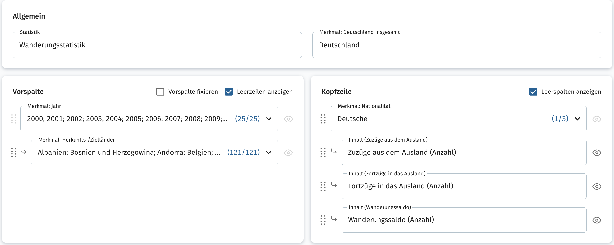
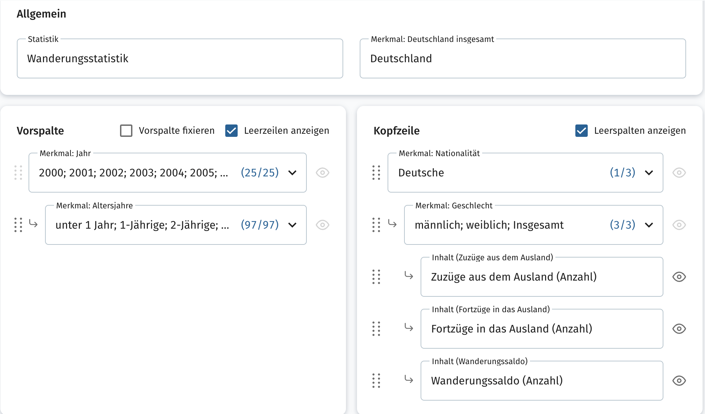

# German Migration Analysis 🇩🇪🌍

## ⚙️ Methology

### Step 1: Export raw data

#### Destatis

- Source: [Statistischer Bericht - Wanderungen - 2024](https://www.destatis.de/DE/Themen/Gesellschaft-Umwelt/Bevoelkerung/Wanderungen/Publikationen/Downloads-Wanderungen/statistischer-bericht-wanderungen-2010120247005.html?templateQueryString=wanderungen+altersgruppen)

#### GENESIS

- Source: ([genesis.destatis.de](https://www-genesis.destatis.de))

- Period: 2000 - 2024

- Table Codes: 12711-0006, 12711-0008

- Filters:  

---

### Step 2: Cleaning raw data

- Extracted migration totals from Excel sheet `csv-12711-02` and transformed into **long time-series format**.  
- Standardized column names to **english, lowercase** (`year`, `direction`, `value`, `dimension_type`, `dimension_value`).  
- Validated missing values and ensured consistent formatting.  
- Cleaned datasets saved as CSV:  
  - `migration_totals_long_clean.csv`  
  - `migration_country_long_clean.csv`  
  - `migration_age_long_clean.csv`

---

### Step 3: Integrating datasets

- Combined the three cleaned datasets into a **single master dataset** (`migration_master_dataset.csv`) in **long form**, suitable for pivoting and analysis.  
- Added a `dimension_type` column to distinguish between:  
  - `global` → totals  
  - `country` → by country  
  - `age` → by age group  
- Columns in master dataset:
  - `year, dimension_type, dimension_value, direction, value`
- Ensured **consistent long-form structure**, all lowercase headers, ready for EDA and Return Rate calculations.

---

### Step 4: Calculating Return Rate

- Pivoted master dataset by `year` and `direction` to calculate **global, country-level, and age-level return rates** 

- Filtered master dataset to only include years ≥ 2000

- Formula: *Return Rate (in %) = (Immigration ÷ Emigration) × 100*

- Saved results in separate CSVs for easier downstream analysis:  
  - `return_rate_global.csv`  
  - `return_rate_country.csv`  
  - `return_rate_age.csv`

---

### Notes / Next Steps

- The master dataset serves as **the reference dataset** for all further analyses, visualizations, and BI reporting.  
- Next steps include:  
1. **Exploratory Data Analysis (EDA)** – identifying trends, anomalies, and patterns.  
2. **Integrating secondary data** – e.g., population, GDP, or unemployment per country to enrich insights.  
3. **Generating visualizations** – line charts for migration trends, heatmaps by country, age pyramids, etc.
